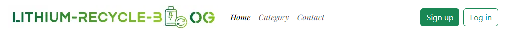
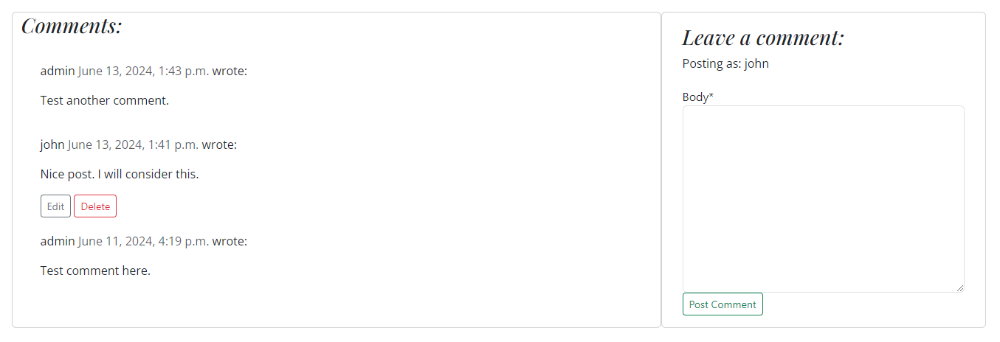
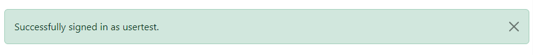

#  
Lithium-ion Battery Recycle Blog 

\
&nbsp;

## Introduction

Welcome to my repository that represents Lithium-ion Battery Recycle Blog website.
It is a blog website to share knowledge, encourage users for more interaction and increase learning about recycling lithium-ion batteries.

 This repository contains the code for building a modern and responsive blog website using Bootstrap for styling, Django for backend development, and a combination of JavaScript and Python for dynamic functionality.

Visit [Lithium Battery Recycle Blog](https://lithium2023-734017e000a2.herokuapp.com/) website

Visit [GitHub Repository](https://github.com/Ahmadalhindi/lithium-battery-recycle-blog)

- - -

\
&nbsp;

## Contents

- [Introduction](#introduction)
- [User Experience/UX](#user-experienceux)
  - [Site Objectives](#site-objectives)
  - [Target Audience](#target-audience)
  - [User Stories](#user-stories)
- [Structure](#structure)
  - [Entity-Relationship Diagram ERD](#entity-relationship-diagram-erd)
  - [Database Plan](#database-plan)
- [Skeleton](#skeleton)
  - [Wireframes](#wireframes)
  - [Fonts](#fonts)
  - [Responsive Screens](#responsive-screens)
- [Features](#features)
  - [All pages](#all-pages)
  - [Homepage](#homepage)
  - [Post Detail](#post-detail)
  - [Sign Up](#sign-up)
  - [Sign Out](#sign-out)
  - [Admin Panel](#admin-panel)
- [Technologies Used](#technologies-used)
- [Testing](#testing)
  - [Manual Test](#manual-test)
  - [Responsive Screens Testing](#responsive-screens-testing)
  - [Code Validation](#code-validation)
- [Bugs](#bugs)
  - [Fixed Bugs](#fixed-bugs)
  - [Unfixed Bugs](#unfixed-bugs)
- [Deployment](#deployment)
- [Credits](#credits)

\
&nbsp;

- - -

# User Experience/UX

## Site Objectives
- Share knowledge and increase learning about recycling lithium-ion batteries.
- Encourage social and friendly interactions between users.
- Achieve the SDGs and sustainability goals for a better green environment.
- Nonprofit website.

## Target Audience
- Users that are interested in gaining more knowledge about recycling lithium-ion batteries.
- Users that own electric vehicle / EV based on lithium-ion battery.
- Environmentalists who stand up for the environment and renewable energy.
- Investors who are interested in buying stocks from lithium battery recycle forms.
- People who can't afford to pay for membership.

## Agile Methodology 
Milestones & User Stories:

The project was developed with 6 milestones and each contains their user stories that labeled according to its priority:

Link to the [Lithium Recycle Blog User stories project](https://github.com/users/Ahmadalhindi/projects/12).

### Milestone: Categories
| 
#
 | 
Title
 |  
User/Registered user/Admin
 | 
Content
 | 
Label
 |
| :------: | :------: | :------: | ------ | :------: |
| [2](https://github.com/Ahmadalhindi/lithium-battery-recycle-blog/issues/2) | View categories | User/Registered User/Admin | I want to be able to view all the categories as default so that I can fast choose one particular category. | Must have |
| [3](https://github.com/Ahmadalhindi/lithium-battery-recycle-blog/issues/3) | List the Categories | User/Registered User/Admin | I want to be able to view the categories on navigation bar as buttons so that I can freely click on each category without leaving the category navigation bar in the home page. | Nice to have |
| [19](https://github.com/Ahmadalhindi/lithium-battery-recycle-blog/issues/19) | Manage Categories | Admin | I want to be able to create, edit and delete categories so that I can organize and categorize posts effectively. | Must have |

### Milestone: Blog Posts
| 
#
 | 
Title
 |  
User/Registered user/Admin
 | 
Content
 | 
Label
 |
| :------: | :------: | :------: | ------ | :------: |
| [4](https://github.com/Ahmadalhindi/lithium-battery-recycle-blog/issues/4) | View List Blog Posts | User/Registered User/Admin | I want to view a list of all blog posts as default on the homepage so that I can fast select one to read. | Must have |
| [6](https://github.com/Ahmadalhindi/lithium-battery-recycle-blog/issues/6) | View Posts of each Category in the same page | User/Registered User/Admin | I want to view a list of blog posts of each category in the same page so that I can easily click on category links and see the corresponding blog posts in the same page. | Nice to have |
| [7](https://github.com/Ahmadalhindi/lithium-battery-recycle-blog/issues/7) | Read Full Blog Post | User/Registered User/Admin | I want to be able to click on a specific blog post so that I can access its complete content. | Must have |
| [8](https://github.com/Ahmadalhindi/lithium-battery-recycle-blog/issues/8) | Manage Blog Posts | Admin | I want to be able to create, read, update and delete posts so that I can manage my posts if necessary. | Must have |
| [9](https://github.com/Ahmadalhindi/lithium-battery-recycle-blog/issues/9) | Create Draft Posts | Admin | I want to be able to create draft posts so that I can freely complete writing the drafts the time I want. | Should have |

### Milestone: Comments
| 
#
 | 
Title
 |  
User/Registered user/Admin
 | 
Content
 | 
Label
 |
| :------: | :------: | :------: | ------ | :------: |
| [10](https://github.com/Ahmadalhindi/lithium-battery-recycle-blog/issues/10) | Comment on Blog Posts | Registered User/Admin | I want to be able to leave comments on blog posts so that I can engage on the post and share my thoughts. | Must have |
| [11](https://github.com/Ahmadalhindi/lithium-battery-recycle-blog/issues/11) | Approve Comments | Admin | I want to be able to approve or disapprove comments on blog post so that I can ensure the quality of conversation on the site. | Should have |
| [12](https://github.com/Ahmadalhindi/lithium-battery-recycle-blog/issues/12) | View Comments | User/Registered User/Admin | I want to be able to view comments on each post so that I can read the conversation. | Must have |
| [20](https://github.com/Ahmadalhindi/lithium-battery-recycle-blog/issues/20) | Delete Comments | Registered User/Admin | I want to be able to delete my own comments so that I can manage and control my own comments. | Should have |
| [21](https://github.com/Ahmadalhindi/lithium-battery-recycle-blog/issues/21) | Edit Comments | Registered User/Admin | I want be able to edit my own comment so that I can correct the comment that I posted when I need. | Must have |
| [22](https://github.com/Ahmadalhindi/lithium-battery-recycle-blog/issues/22) | Approve Edited Comments | Admin | I want Approve Edited Comments so that I can assure the safety of the website. | Should have |

### Milestone: Like/Unlike
| 
#
 | 
Title
 |  
User/Registered user/Admin
 | 
Content
 | 
Label
 |
| :------: | :------: | :------: | ------ | :------: |
| [13](https://github.com/Ahmadalhindi/lithium-battery-recycle-blog/issues/13) | View Likes | User/Registered User/Admin | I want to be able to see how many likes in post so that I can know how important this post. | Must have |
| [14](https://github.com/Ahmadalhindi/lithium-battery-recycle-blog/issues/14) | Like/Undo Like Posts | Registered User/Admin | I want to be able to like or Like/undo like for blog posts so that I can express my opinion on the content. | Must have |

### Milestone: Authentication
| 
#
 | 
Title
 |  
User/Registered user/Admin
 | 
Content
 | 
Label
 |
| :------: | :------: | :------: | ------ | :------: |
| [15](https://github.com/Ahmadalhindi/lithium-battery-recycle-blog/issues/15) | User Registration | User | I want to be able to sign up for a new account with a unique username and password so that I can comment and like. | Must have |
| [18](https://github.com/Ahmadalhindi/lithium-battery-recycle-blog/issues/18) | Log in / Log out | Registered User/Admin | I want to be able to log in and log out from my account so that I can interact with the blog and ensure the safety of my personal content when I log out. | Must have |

### Milestone: Design
| 
#
 | 
Title
 |  
User/Registered user/Admin
 | 
Content
 | 
Label
 |
| :------: | :------: | :------: | ------ | :------: |
| [5](https://github.com/Ahmadalhindi/lithium-battery-recycle-blog/issues/5) | Site Pagination | User/Registered User/Admin | I want to view a paginated list of posts so that easily select post to view. | Nice to have  |
| [16](https://github.com/Ahmadalhindi/lithium-battery-recycle-blog/issues/16) | Responsive Design | User/Registered User/Admin | I want the blog site to be responsive as accessing from different devices so that I can easily surf and navigate the site on various screen sizes. | Must have |

- - -

[Back to contents](<#contents>)

\
&nbsp;

# Structure

## Entity-Relationship Diagram ERD

## Database Plan

### Category Model:

| 
Attribute
 | 
Type
 | 
Detail
 | Key/Relation
|:-------------:|:-------------:|--------------|------------|
| name | str/char(100)    | The name of the category    | 

### Post Model:
| 
Attribute
 | 
Type
 | 
Detail
 | 
Key/Relation

|-------------|-------------|--------------|------------|
| title | str/char(200)    | The title of the post | 
| slug | str/char(200)    | A unique slug for the post's URL | 
| author | User | The author of the post | ForeignKey to User model
| category | Category | The category to which the post belongs | ForeignKey to Category model
| content | str/text   | The main content of the post | 
| featured_image | CloudinaryField | The featured image of the post | 
| likes | QuerySet | The users who liked the post | manytomany to User model |
| created_at | datetime | The timestamp when the post was created | 
| updated_at | datetime | The timestamp when the post was last updated | 
| status | int | The status of the post (Draft or Published) | 
| name | str/text | A short excerpt from the post | 

### Comment Model:
| 
Attribute
 | 
Type
 | 
Detail
 | 
Key/Relation

|-------------|-------------|--------------|------------|
| post | Post | The post to which the comment belongs | ForeignKey to Post model |
| name | str/char(90)    | The name of the commenter | 
| email | str/email | The email of the commenter |
| body | str/text | The content of the comment |
| created_at | datetime   | The timestamp when the comment was created | 
| approved | bool | Indicates whether the comment is approved or not |

- - -

[Back to contents](<#contents>)

\
&nbsp;

# Skeleton
## Wireframes
- Home page:

- Post-detail page:

## Fonts
- Playfair Display: features a modernized version of past fonts that mimicked the styling of ink pens.
  - (Italic, 500) Used for heading h3, h4 

- Open Sans: focuses on neutrality and friendliness, one of the best choices for bloggers everywhere.
  - (500) Used for heading h2, h5
  - (400) Used for Paragraph

## Responsive Screens
The website delivers a consistent and user-friendly experience across a wide range of devices, contributing to improved usability and accessibility.

### Breakpoints
- **Desktop**: 992px and above
  - Navigation bar with visibility for logo and all items and buttons
  - Grid layout adjusts to accommodate larger screen sizes.
- **Tablet**: 768px - 991px
  - Navigation bar: logo remains visible, but items and buttons may collapse to a hamburger drop down menu.
  - Blogs will be listed vertically.
- **Mobile**: Below 768px
  - Navigation bar: the Logo and the hamburger icon will vertically align.
  - Content stacks vertically for easier scrolling on smaller screens.

- - -

[Back to contents](<#contents>)

\
&nbsp;

# Features

## All pages
All pages of a website have a navigation bar, hero section and footer. The purpose is to enhance user experience, improve navigation, and provide consistent branding and functionality across the entire site.

### Navigation Bar
Intuitive, efficient, and located on top of all pages for helping users find the information they're looking for quickly and easily.

- Logo: It is created as a brand image positioned at the left-hand side. Contains text that represents the name of the website and the letter "L" replaced by an icon to illustrate the recycling battery. Clicking on the logo directs users back to the homepage.

- Menu Items:
  - **Home Item**: Takes users back to the homepage.
  - **Category Item**: Clicking on it to list all the buttons of categories.
  - **Contact Item**: Leads to section that Offers contact information.

- Call to Action Buttons:
  - **Log in/Sign Up**: Smooth buttons positioned at the right-hand side. encouraging users to log in to existing accounts or sign up for new ones.

### Hero section:
A captivating image under navigation bar to give a visual Appeal and Contextual Information that grab visitors' attention to make a strong first impression, encourage visitors to explore further and convey the website's main message or value proposition succinctly.

### Footer
Enhancing the accessibility and credibility of a website by providing important information to visitors.
- **Social Media Bar**: Icons that allow visitors to connect with the website on social media platforms.
- **Conact and About Us**: Give more information about the website and how to get in touch with us. 
- **Copyright**: This helps protect the intellectual property of the website owner. With link to the top of the page.

## Homepage
Our homepage provides a snapshot of what the website offers and guides users to explore further.
It contains the header and the footer that mentioned above, beside:

### Categories Section
It serves as a user-friendly way for visitors to explore the diverse range of content offered by the blog, facilitating easy navigation and discovery of articles that match their interests.

- **Layout and Placement**: it is positioned prominently on the homepage under header and arranged horizontally across its navigation bar, allowing users to easily see and access them for quick navigation. It also be reached by clicking on the category item in the navigation bar.
- **List all categories**: It displayed all automatically by default for easy access when opening the homepage for easy access.
- **Open Corresponding Posts**: When a user clicks on a specific category button, it opens a corresponding section of the blog on the same page, providing a seamless browsing experience.

### Posts Section
The blog list section on a homepage serves as a dynamic showcase of the website's brief blog content, inviting visitors to delve deeper into the site and engage with its offerings.

- **List all Blog Posts**: It displayed all automatically by default when opening the homepage for easy access.
- **Pagination**: Divided by 4 - Allowing visitors to easily navigate through multiple pages to view more blog posts.
- Each blog post include:
  - Thumbnail Image.
  - Author name.
  - Title.
  - Brief Excerpt.
  - Publication Date.
  - Read More button: to access the full post

## Post Detail 
This page allows visitors to read the full blog post and allows the registered users to interact with each other and with the admin by leaving comments and likes.
- **Blog full display section**
  - Image
  - Title
  - Author
  - Content

- **Like button icon**: Allows visitors to see the number of likes and lets registered users to like/undo like posts.

- **Comment icon**: Allows visitors to see the number of comments.

- **Comment section**:
For engage in discussions, share opinions, provide feedback, ask questions, or offer additional insights related to the blog content.

 The below picture displayed for visitors:

 The below picture displayed for registered user (john):

 The below picture displayed for the admin:

  - Display comments section: Allows visitors to see all comments with the name of commenters and dates of commenting. Also let the registered users delete their comments by clicking on the red button.

  - Leave a comment section: Allows registered users to write a comment. But instead for visitor will display a welcoming message provided with a link to log in for leaving a comment.

    **Hint**: For new comment and edited comment, the comment will not appear in the display comment section until the admin approves it.

- Edit comments: Displayed only to the owner of the comment to correct/update realted comment as a button - this comment need approval from admin after post it.

- Delete comments: Displayed only to the owner of the comment to delete related comment as a button.

  Confirmation delete comment: Yes/No selects to assert more caution.

- **Back button to same cayegory**: Button will allow users to go back to the same category that belongs to the post.

### Succes/Error Messages and Validation:

- Create/edit/delete comments:

## Sign Up
 Sign up Page considered as the entry point for new users to create accounts and access the platform's features like leave a comment, delete their own comment, or like a post.

 

### Sign up Option
Provide a link to Sign in if the user already registered.
### Sign up Form
- Username
- Email (optional)
- Password
- Confirm Password

### Sign up Button
A button to submit the form.

### Error Messages and Validation:
If there are any errors in the sign-up form, such as missing fields, invalid input, the page displays clear error messages indicating what went wrong and how the user can correct it.

Below pictures refer such example error messages:

### Confirmation Message:
After successfully signing up, a confirmation message is displayed to inform users that they have been registered.

This message will auto close with timeout after 2 seconds.

## Sign In 
This page will allow users to access their accounts or create new ones to interact with the site's content, such leave a comment or like a post.

### Sign in Option
Provide a link to Sign up if the users have not registered yet.

### Sign in Form
- Username
- Password
- "Remember Me" Option

### Error Messages and Validation:
If there are any errors in the sign in form, such as missing fields, invalid input or incorrect the page displays clear error messages indicating what went wrong and how the user can correct it.

Below picture refers example error message:

### Confirmation Message
After successfully signing in, a confirmation message displayed to inform users that they have been logged in.

This message will auto close with timeout after 2 seconds.

## Sign Out
Sign out Page is considered as the endpoint for registered users who wish to log out of their accounts.

- **Log out Button**: located in the navigation bar on the homepage.
- **Confirmation Page**: A new page displaying confirmation message asking logged in user if they want to log out by clicking the red button.
- **Confirmation Message**: After successfully signing out, a confirmation message displayed to inform logged in users that they have been logged out.
This message will auto close with timeout after 2 seconds.

## Admin Panel
Django Administration allows admin to manage database by create, update and delete (CRUD) the categories, posts and comments.

For more information visit the [manual test](readme_manual_test.md) page.

- - -

[Back to contents](<#contents>)

\
&nbsp;

# Technologies Used

## Languages
- [HTML5](https://en.wikipedia.org/wiki/HTML "HTML") and [CSS3](https://en.wikipedia.org/wiki/CSS "CSS") For markup and styling of the website's frontend.
- [JavaScript](https://en.wikipedia.org/wiki/JavaScript "JavaScript") Used for dynamic interactions and enhancing user experience.
- [Python]( https://en.wikipedia.org/wiki/Python_(programming_language) "Python") Handle various backend tasks efficiently.
## Frameworks 
- [Django3.2.23](https://www.djangoproject.com/ "Django") Backend framework, handling data management, user authentication, and routing.
- [Bootstrap5](https://getbootstrap.com/ "Bootstrap") For frontend development, providing a sleek and responsive design.

## Libraries and Tools
- [cloudinary](https://cloudinary.com/ "cloudinary") - Used to store website's images.
- [elephandSQL](https://www.elephantsql.com/) Used to store and manage PostgreSQL database.
- [gitpod](https://www.gitpod.io/ "gitpod") – Used as the development to build the page.
- [gitHub](https://github.com/ "gitHub") – The project’s Version Control Management System.
- [google fonts](https://fonts.google.com/ "google Fonts") – For fonts used in the site.
- [psycopg2](https://pypi.org/project/psycopg2/ "google Fonts") – Is the popular PostgreSQL adapter used in  Python.
- [gunicorn](https://gunicorn.org/ "gunicorn") Allows to run multiple Python processes within a single dyno
- [crispy-forms](https://django-crispy-forms.readthedocs.io/en/latest/ "crispy-forms") – Control the rendering behavior of Django forms.
- [django-extensions](https://pypi.org/project/django-extensions/ "django-extensions") - Add functionality to the project.
- [django-allauth](https://docs.allauth.org/en/latest/ "django-allauth") Addressing authentication, registration, account management as well as 3rd party (social) account authentication.
- [django-summernote](https://github.com/summernote/django-summernote/blob/main/README.md "django-summernote") Support admin mixins and widgets.
- [graphviz](https://graphviz.org/ "Graphviz") Set of tools for visualizing graph data, ERD in our project.
- [pyparsing](https://pypi.org/project/pyparsing/ "pyparsing") Library for parsing text strings.
- [pydot](https://pypi.org/project/pydot/ "pydot") Library for creating, manipulating, and visualizing graphs in DOT format.
- [looka](https://looka.com/ "lookas") – Create and design the logo.
- [font awesome](https://looka.com/ "font awesome") – A robust icon set that contains scalable vector icons.
- [cloud convert](https://cloudconvert.com/jpeg-to-webp "cloudconvert") Used to convert images to WEBP.
- [Heroku](https://id.heroku.com/ "Heroku") Used to deploy the project.

## Validation and Auto-test Websites
- [w3c HTML Validation Service](https://validator.w3.org/ "W3C HTML") – To validate HTML files.
- [jigsaw-w3 CSS Validation Service](https://jigsaw.w3.org/css-validator/ "W3C CSS") – To validate the CSS files.
- [jSHint](https://jshint.com/ "JSHint") – To validate JavaScript files.
- [python Syntax Checker PEP8](https://www.pythonchecker.com/ "Python Syntax Checker PEP8") – To validate all the Python files, making sure they align with PEP8.
- [lighthouse](https://chrome.google.com/webstore/detail/lighthouse/blipmdconlkpinefehnmjammfjpmpbjk?hl=en "Lighthouse") – To check the website’s performance and accessibility. Improving the quality of web pages.

- - -

[Back to contents](<#contents>)

\
&nbsp;

# Testing

## Manual Test
Click on provided link to visit the [manual test](readme_manual_test.md) page.

## Responsive Screens Testing
Testing is conducted on various devices including desktops, laptops, tablets, and smartphones.

## Code Validation

### W3C Markup HTML Validator
Tested for homepage by W3c HTML Markup validation service and fixed the trailing slash and subtree errors. Then passed with no more errors.

And tested for all other pages and passed, except one error in the post_detail template is not fixed, the element "p end tag" located inside the root of Django.

### Jigsaw W3 CSS Validator
CSS tested by Jigsaw W3 CSS Validation service and passed with no errors.

But found 8 warnings about vendor extension, that no harm if not fix it.

### JS Hint
Tested JavaScript code with only two warnings.

Tested again after fixing it and passed with no more warnings.

### PEP8 CI Python checker
All python files tested with no errors, except for one error in views for long line:

### Lighthouse

The website performed well when it came to the lighthouse test.

- - -

[Back to contents](<#contents>)

\
&nbsp;

# Bugs

## Fixed Bugs
- **The draft post keeps displaying in the site**:

  To prevent draft posts from appearing in the site:
  
  views.py - in PostListView class by replace the queryset variable at get_queryset function and return it to get all posts or posts with specified category that filtered by statue as published and date created.

- **ModuleNotFoundError: No module named 'django_extensions'**

  Debug it by adding the module to requirements.txt file.

- **favicon.ico not found when deploying to Heroku**

  Debug it by creating a blank favicon.ico file in static folder.

## Unfixed Bugs
- The posts not sorted by date created.
- Uncaught (in promise) Error: A listener indicated an asynchronous response by returning true, but the message channel closed before a response was received

- - -

[Back to contents](<#contents>)

\
&nbsp;

# Deployment

## Create Heroku Application

-  Log in to Heroku account.
- Create a new application by clicking on new button then select Create new app.
- Write application name then select the region then click on Create App.

## ElephantSQL & Cloudinary
- Log in to ElephantSQL.
- Make a new instance.
- Copy the URL to use it for the further step.

## Create Django Blank project and app with environment
- Install django gunicorn and its libraries psycopg2 and cloudinary-storage.
- Add those libraries to requirements.txt
- Create the project name.
- Create the app name, then add it to settings.py
- Migrate the changes and push it.
- Write application name then select the region then click on Create App.
- add the DATABASE_URL, SECRET_KEY & CLOUDINARY_URL to the settings.py file
- Add the values of SECRET_KEY, DATABASE_URL and CLOUDINARY_URL keys at env.py and setting files.
- Create import os statement for the env.py 
- Add Heroku ALLOWED_HOSTS with localhost in settings.py
- Created the Procfile and integrate it with the project.
- Make add, commit, and push the changes to Github.

## Heroku Deployment
- log in again and select the heroku app you created.
- Settings tab, then at Config Vars add those:
  - key: PORT | value: 8000
  - key: SECRET_KEY | value: Django Secret Key from settings.py
  - key: CLOUDINARY_URL | value: Cloudinary API URL
  - key: DATABASE_URL | value: ElephantSQL database URL
- Deploy tab to connect with github account.
- Connect to the repository.
- Click on the deploy button.

Well done for deploying your application!

- - -

\
&nbsp;

# Credits
- [medium](https://medium.com/@legaladvisory/exploring-the-impact-of-lithium-ion-battery-recycling-on-the-supply-chain-ad81fbd77275 "medium"), [jauch blog](https://www.jauch.com/blog/en/the-lithium-batterys-beginnings/ "jauch blog"), and [pollyproducts](https://pollyproducts.com/lithium-batteries-are-causing-fires-at-recycling-plants-are-they-really-environmentally-friendly/ "pollyproducts"): Images
- [eco serve](https://ecoserveindia.com/the-importance-of-lithium-ion-battery-recycling.html "eco serve"), [lohum](https://lohum.com/media/blog/environmental-and-social-benefits-of-lithium-battery-recycling// "lohum"), [medium](https://medium.com/@battrixxindustry/revolutionizing-li-ion-battery-recycling-for-a-sustainable-tomorrow-6532084c9382 "medium"), [PrecisionPulseg](https://www.linkedin.com/pulse/sizeable-growth-lithium-ion-battery-recycling-market-trends-1zdhc/?trk=article-ssr-frontend-pulse_more-articles_related-content-card "PrecisionPulse"): Blogs and articles.
- [code institute](https://learn.codeinstitute.net/login?next=/ "code institute"): I think therefore I blog.
- [stack overflow](https://stackoverflow.com/ "stack overflow"): Function for filter posts by selected category and docstrings.
- [bootstrap](https://getbootstrap.com/docs/5.3/getting-started/introduction/ "bootstrap"): Navbar and buttons.
- [MDB](https://mdbootstrap.com/docs/standard/navigation/footer/examples-and-customization/ "MDB"): Footer.
- [Suraj Katwal - wplogout](https://www.wplogout.com/export-database-diagrams-erd-from-django/?unapproved=4810&moderation-hash=1f8e0dda1465cb535b42a74c3759eed6#comment-4810 "wplogout"): Export ERD from Django.

- - -

\
&nbsp;

[Back to top](<#introduction>)