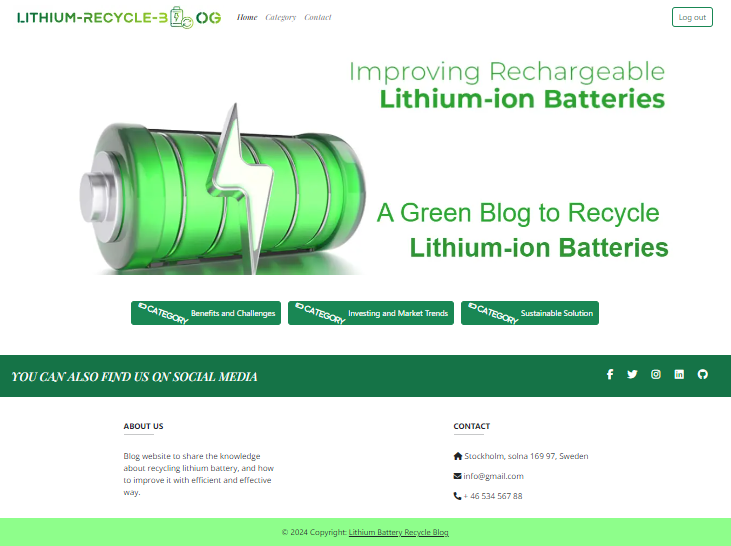
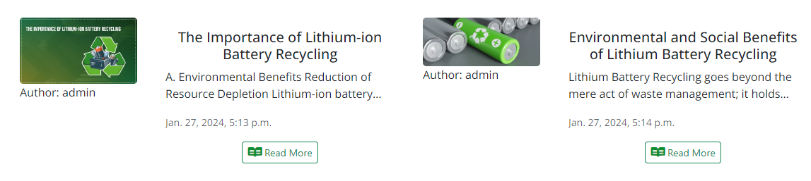
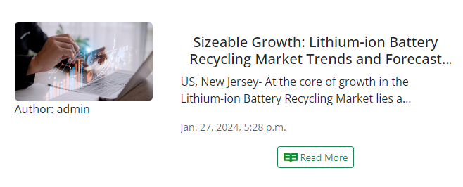
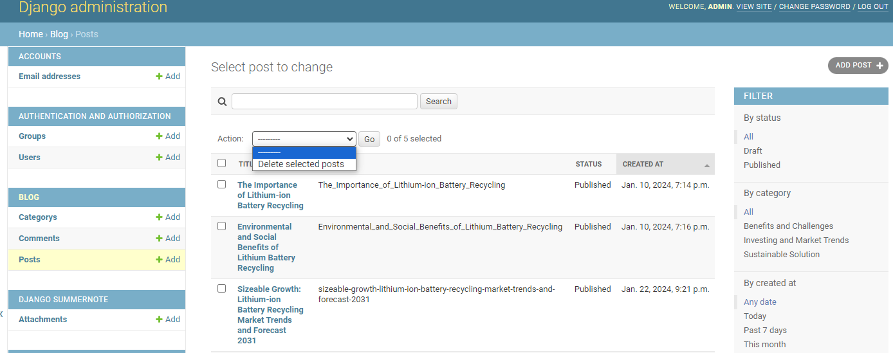

# Manual Tests

[Back to README.md](/workspace/lithium-battery-recycle-blog/README.md)

\
&nbsp;
[2](https://github.com/Ahmadalhindi/lithium-battery-recycle-blog/issues/2) - View categories:

As an/a User I want to be able to view the categories so that the site will be organized by head categories.

When open Home page or Category in head navigation bar it lists all categories: 

\
&nbsp;
[3](https://github.com/Ahmadalhindi/lithium-battery-recycle-blog/issues/3) - List the categories on navigation bar:

As an/a User I want to be able to view the categories on navigation bar as buttons so that I can freely click on specific category without leaving the home page.

\
&nbsp;
[4](https://github.com/Ahmadalhindi/lithium-battery-recycle-blog/issues/4) - View List Blog Posts:

As a User I want to view a list of blog posts on the homepage so that I can select one to read.

\
&nbsp;
[5](https://github.com/Ahmadalhindi/lithium-battery-recycle-blog/issues/5) - Site pagination:

As a User I want to view a paginated list of posts so that easily select post to view.

\
&nbsp;
[6](https://github.com/Ahmadalhindi/lithium-battery-recycle-blog/issues/6) - View posts of each category in the same page:

As a User I want to view a list of blog posts of each category in the same page so that I can easily click on category links and see the corresponding blog posts in the same page.

\
&nbsp;
[7](https://github.com/Ahmadalhindi/lithium-battery-recycle-blog/issues/7) - Read Full Blog Post:

As a User I want to be able to click on a specific blog post so that I can access its complete content.

\
&nbsp;
[8](https://github.com/Ahmadalhindi/lithium-battery-recycle-blog/issues/8) - Manage blog posts:

As an Admin I want to be able to create, read, update and delete posts so that I can manage my posts if necessary.

\
&nbsp;
[9](https://github.com/Ahmadalhindi/lithium-battery-recycle-blog/issues/9) - Create draft posts:

As an Admin I want to be able to create draft posts so that I can freely complete writing the drafts the time I want.

\
&nbsp;
[10](https://github.com/Ahmadalhindi/lithium-battery-recycle-blog/issues/10) - Comment on Blog Posts:

As a/an Registered User/Admin I want to be able to leave comments on blog posts so that I can engage on the post and share my thoughts.

\
&nbsp;
[11](https://github.com/Ahmadalhindi/lithium-battery-recycle-blog/issues/11) - Approve Comments:

As an Admin I want to be able to approve or disapprove comments on blog post so that I can ensure the quality of conversation on the site.

\
&nbsp;
[12](https://github.com/Ahmadalhindi/lithium-battery-recycle-blog/issues/12) - View comments:

As a/an User/admin I want to be able to view comments on each post so that I can read the conversation.

\
&nbsp;
[13](https://github.com/Ahmadalhindi/lithium-battery-recycle-blog/issues/13) - View likes:

As a/an User/Admin I want to be able to see how many likes in post so that I can know how important this post.

\
&nbsp;
