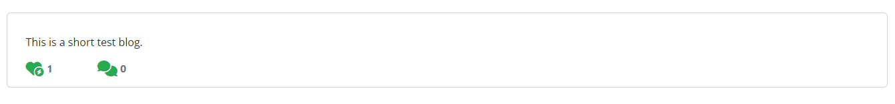

# Manual Tests

[Back to README.md](/workspace/lithium-battery-recycle-blog/README.md)

\
&nbsp;
[2](https://github.com/Ahmadalhindi/lithium-battery-recycle-blog/issues/2) - View categories:

As an/a User I want to be able to view all the categories as default so that I can fast choose one particular category.

\
&nbsp;
[3](https://github.com/Ahmadalhindi/lithium-battery-recycle-blog/issues/3) - List the Categories:

As an/a User I want to be able to view the categories on navigation bar as buttons so that I can freely click on specific category without leaving the home page.

\
&nbsp;
[4](https://github.com/Ahmadalhindi/lithium-battery-recycle-blog/issues/4) - View List Blog Posts:

As a User I want to view a list of all blog posts as default on the homepage so that I can fast select one to read.

\
&nbsp;
[5](https://github.com/Ahmadalhindi/lithium-battery-recycle-blog/issues/5) - Site pagination:

As a User I want to view a paginated list of posts so that easily select post to view.

\
&nbsp;
[6](https://github.com/Ahmadalhindi/lithium-battery-recycle-blog/issues/6) - View posts of each category in the same page:

As a User I want to view a list of blog posts of each category in the same page so that I can easily click on category links and see the corresponding blog posts in the same page.

\
&nbsp;
[7](https://github.com/Ahmadalhindi/lithium-battery-recycle-blog/issues/7) - Read Full Blog Post:

As a User I want to be able to click on a specific blog post so that I can access its complete content.

\
&nbsp;
[8](https://github.com/Ahmadalhindi/lithium-battery-recycle-blog/issues/8) - Manage blog posts:

As an Admin I want to be able to create, read, update and delete posts so that I can manage my posts if necessary.

Create a new post:

Update the post:

Delete the post

\
&nbsp;
[9](https://github.com/Ahmadalhindi/lithium-battery-recycle-blog/issues/9) - Create draft posts:

As an Admin I want to be able to create draft posts so that I can freely complete writing the drafts the time I want.

\
&nbsp;
[10](https://github.com/Ahmadalhindi/lithium-battery-recycle-blog/issues/10) - Comment on Blog Posts:

As a/an Registered User/Admin I want to be able to leave comments on blog posts so that I can engage on the post and share my thoughts.

Need to sign up/log in to comment:

Write a comment:

Comment published:

\
&nbsp;
[11](https://github.com/Ahmadalhindi/lithium-battery-recycle-blog/issues/11) - Approve Comments:

As an Admin I want to be able to approve or disapprove comments on blog post so that I can ensure the quality of conversation on the site.

Write a comment:

Apear a hint for user to wait for approval:

Approve the comment by admin in admin-panel:

Comment appearing:

\
&nbsp;
[12](https://github.com/Ahmadalhindi/lithium-battery-recycle-blog/issues/12) - View comments:

As a/an User/admin I want to be able to view comments on each post so that I can read the conversation.

\
&nbsp;
[13](https://github.com/Ahmadalhindi/lithium-battery-recycle-blog/issues/13) - View likes:

As a/an User/Admin I want to be able to see how many likes in post so that I can know how important this post.

\
&nbsp;
[14](https://github.com/Ahmadalhindi/lithium-battery-recycle-blog/issues/14) - Like/undo like Posts:

As a/an Registered User/Admin I want to be able to like or undo like for blog posts so that I can express my opinion on the content.

Click on ike:

Click again to undo like:

\
&nbsp;
[15](https://github.com/Ahmadalhindi/lithium-battery-recycle-blog/issues/15) - User Registration:

As a User I want to be able to sign up for a new account with a unique username and password so that I can comment and like.

\
&nbsp;
[18](https://github.com/Ahmadalhindi/lithium-battery-recycle-blog/issues/18) - Log in / Log outs:

As a/an Registered User/Admin I want to be able to log in and log out from my account so that I can interact with the blog and ensure the safety of my personal content when I log out.

Sign in:

Sign out:

\
&nbsp;
[19](https://github.com/Ahmadalhindi/lithium-battery-recycle-blog/issues/19) - Manage Categories:

As an Admin I want to be able to create, edit and delete categories so that I can organize and categorize posts effectively.

Create new category:

Update the category:

Delete the category:

\
&nbsp;
[20](https://github.com/Ahmadalhindi/lithium-battery-recycle-blog/issues/20) - Delete comments:

As a/an Registered User/Admin I want to be able to delete my own comments so that I can manage and control my own comments.

Click on Delete Comment button:

Confirm delete comment:

Comment deleted:

\
&nbsp;